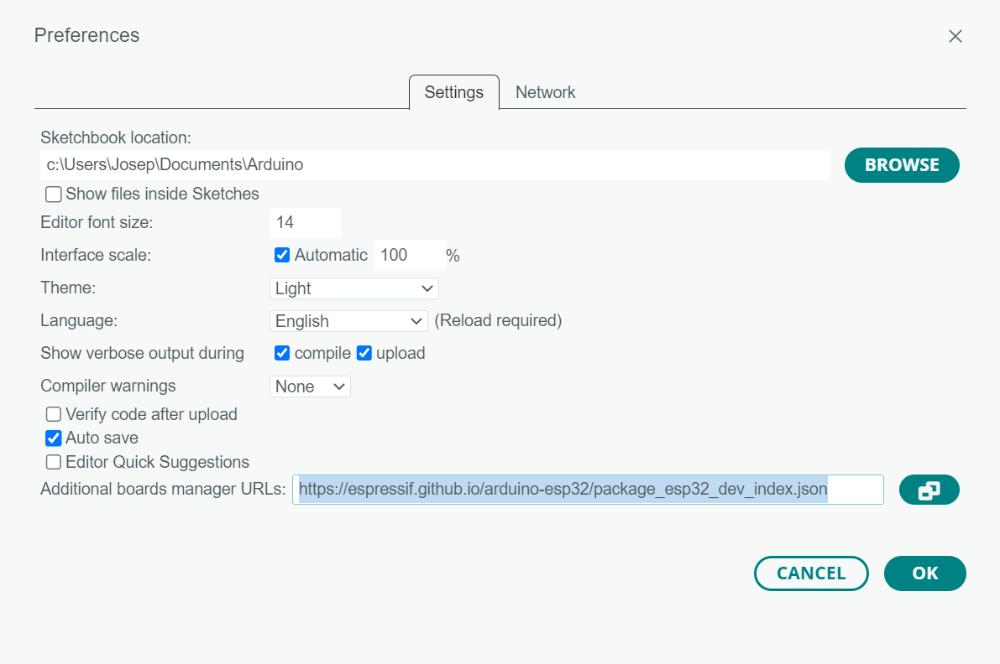
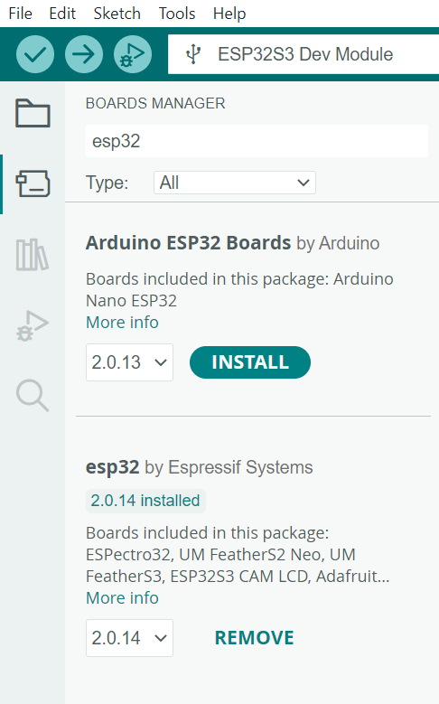
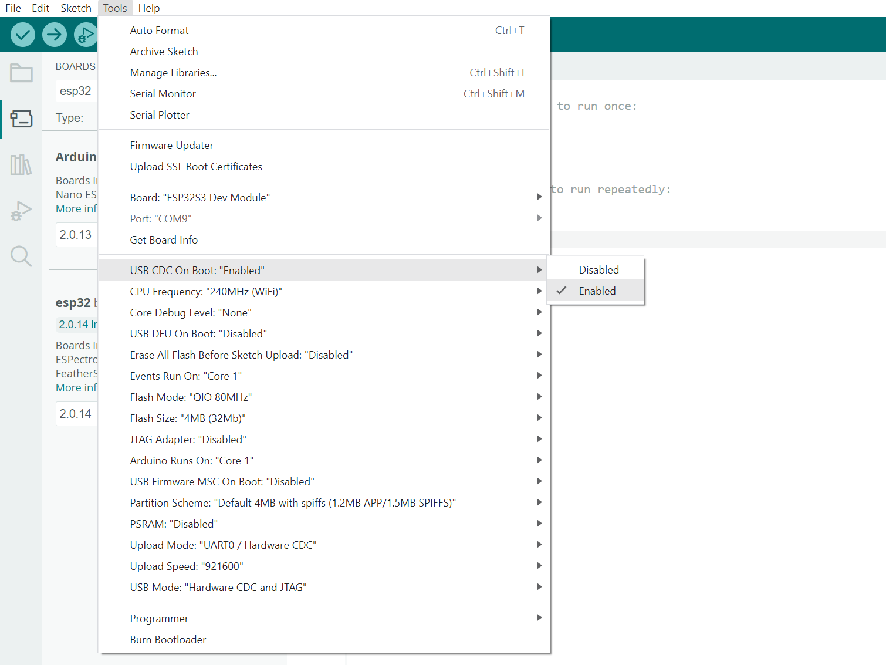

# How to set up the Arduino IDE

The first thing to do to progam the Barduino 4 is to set up the Arduino IDE. Follow this steps to do so: 

1. Install Arduino IDE
    - You can go to the [Arduino official page](https://www.arduino.cc/en/software) an download the last version of the Arduino IDE.
2. Add the Additional Boards URL
    - Open the preferences menu **File/Preferences**
    - In the *Additional Boards URL's* dialog add the next line:

    ```
    https://espressif.github.io/arduino-esp32/package_esp32_dev_index.json
    ```

    

3. Install the Boards Manager
    - Click on the second Icon in the left bar menu or in **Tools/Board/Board Manager** and search esp32
    - Install the boards *esp32 by Espressif Systems*

    

4. Select your board
    - Connect your board and it may appear in the top dropdown as *ESP32S3 Dev Module*, select it.
    - If it doesn't appear with that name, click on it and change the board to *ESP32S3 Dev Module* and select the port where your board is connected. 

    !!! bug
        The first time you connect your board it may connect and disconnect, once you program it, it will show as connected. 

5. Set the correct board parameters: 
    - To make it simple, change the **USB CDC on Boot** to **Enable** under **Tools** to make sure that the *Serial* will print over USB. 
    - To start with it, you can keep the rest of parameters as they show in the picture.

    

6. Program your board!
    - Everything should be ready to upload a code to your new Barduino!